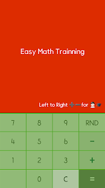
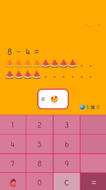

#### 누구나 쉬운 산수
> 구글플레이에 업로드된 산수학습 앱

마켓이동: [누구나 쉬운산수(+-만 연습하기)](https://play.google.com/store/apps/details?id=com.psw.calcultrainer)

특징
- 흔한 kotlin식 사고방식의 소스코드
- [인앱업데이트 API](https://developer.android.com/guide/playcore/in-app-updates?hl=ko) → 구글플레이에 업데이트 있는 지 채크목적

> Context의 확장함수로 정의
~~~kotlin

fun Context.processUpdate(fnOk: (Boolean) -> Unit){
    val appUpdateManager = AppUpdateManagerFactory.create(this)
    val appUpdateInfoTask = appUpdateManager.appUpdateInfo

    appUpdateInfoTask.addOnSuccessListener { apInfo ->
        if (apInfo.updateAvailability() == UpdateAvailability.UPDATE_AVAILABLE){
            fnOk(true)
        } else {
            fnOk(false)
        }
    }

}
~~~

> 사용
~~~kotlin
 override fun onCreate(savedInstanceState: Bundle?) {
        super.onCreate(savedInstanceState)
        setContentView(R.layout.activity_splash)

        processUpdate{
                bUpdate ->
            if(bUpdate){
                showAskUpdateDialog(this)
            } else{
                setUpUIComplte()
            }
        }

 }
~~~

- Deeplink를 통한 웹에서 앱설치 및 실행(파라메터 전송)

> AndroidManifest.xml
~~~xml
<activity
        android:name=".BasicCalculator"
        android:screenOrientation="portrait">

            <intent-filter>
                <action android:name="android.intent.action.VIEW" />
                <category android:name="android.intent.category.DEFAULT" />
                <category android:name="android.intent.category.BROWSABLE" />

                <data android:host="add" android:scheme="easycal" />
            </intent-filter>

</activity>
~~~

> 웹에서 사용
> [참고링크](https://vintageappmaker.tistory.com/249)
~~~html
<html>
    <head>
    	<meta charset="UTF-8">

    	<meta property="og:url"                content="http://vintageappmaker.com/apps/easycal/appcheck.html" />
		<meta property="og:type"               content="website" />
		<meta property="og:title"              content="누구나 쉬운 산수" />
		<meta property="og:description"        content="산수공부를 위한 앱" />
		<meta property="og:image"              content="https://play-lh.googleusercontent.com/vS48CuRkPP92bF-CmaAwovmj7PTgKMjWG0b4sC4_PIcEgvopyIoaGI8GePv7TAiHaw=s180-rw" />

    	
    </head>
    <body>
       	
        	<h1>App 설치 및 실행 - click</h1>   
        	
Android외에는 아무반응을 하지 않습니다.

        	

        
    </body>
</html>
~~~
